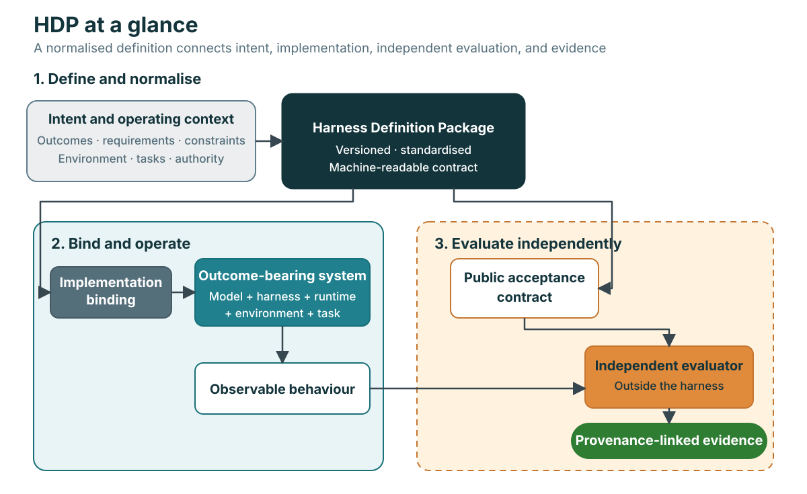

# Harness Definition Package

**A draft, implementation-neutral specification for defining agentic and AI
harnesses in a consistent, machine-readable form.**

The key idea is normalisation. Harness intent and operating rules are often
scattered across prompts, tool configuration, workflow code, permissions,
tests, and documentation. HDP brings those concerns into one versioned contract
covering intended outcomes, requirements, operating context, capabilities,
orchestration, governance, evaluation, evidence, risks, and change control.

That shared structure makes the same harness concepts easier to review, repeat,
transfer between implementations, compare, regenerate, and re-evaluate. Its aim
is to make harness design more repeatable and improve the likelihood that the
resulting system continues to achieve its declared outcomes, without prescribing
a particular model provider, agent framework, runtime, or tool protocol.

> **Draft 0.1:** HDP is an early community specification proposed for
> experimentation and feedback. It is not an accredited standard,
> certification scheme, or claim that a harness is safe or effective.

## Why HDP?

Most harnesses are assembled from prompts, tool configuration, agent roles,
workflow code, permissions, memory, tests, and operational conventions. Those
parts explain mechanics, but usually do not provide one answer to questions
such as:

- What outcome is the whole system responsible for?
- Which assumptions and exclusions make that claim valid?
- What may the model and its tools access or change?
- Which tests are independent from the generated harness?
- What evidence links an outcome to a requirement, component, test, and result?
- When does a model, runtime, evaluator, or environment change require
  re-evaluation?

HDP makes those relationships explicit and machine-readable.

  

*This visual is informative. The specification, schema, ontology, and semantic
rules remain authoritative.*

The evaluator is deliberately outside the model-harness system. Hidden cases,
answers, evaluator-only prompts, and acceptance secrets are not part of an HDP
that the harness can consume.

## What is included?

- [Draft specification](SPECIFICATION.md) — normative definitions, field
  families, conformance, versioning, and extension rules.
- [JSON Schema](schema/hdp.schema.json) — the canonical structural contract.
- [Semantic rules](schema/semantic-rules.yaml) — cross-field constraints that
  JSON Schema cannot express.
- [Ontology](schema/ontology.yaml) — entities and relationships in the HDP
  conceptual model.
- [Profiles](profiles/) — provider-neutral assurance and domain overlays.
- [Templates](templates/) — provider-neutral starting points.
- [Examples](examples/) — minimal, document-review, and software-development
  definitions.
- [Conformance material](conformance/) — fixtures and expected results for
  implementers.
- [Agent Skills](skills/) — portable authoring and reconstruction workflows.

See the [visual package anatomy](docs/assets/hdp-package-anatomy.svg) for how the
24 information families group into six readable domains.

## Quick start

Point your AI at this repository and describe the harness you want to define.
Ask it to read and follow the [`create-hdp` skill](skills/create-hdp/SKILL.md).
You do not need to choose a model provider or agent framework first.

Start by telling the AI:

- what outcome the harness should achieve and for whom;
- where it will operate and what kinds of tasks it will handle;
- what it may access, change, or must never do; and
- how success should be measured independently.

For example:

> Read this repository and use `skills/create-hdp` to draft an HDP for the
> harness I describe. Ask me about missing outcomes, permissions, constraints,
> and acceptance thresholds. Keep unknowns explicit, do not invent business
> intent, and validate the completed definition before presenting it.

If you already have a harness, give your AI access to both this repository and
the existing harness, then ask it to follow
[`analyse-existing-harness`](skills/analyse-existing-harness/SKILL.md). It
should return an evidence-qualified HDP, contradictions, omissions, confidence,
and the human decisions still required.

## Use the Agent Skills

The repository includes two portable skills:

- [`create-hdp`](skills/create-hdp/SKILL.md) turns supported requirements and
  operational context into an HDP draft without inventing missing intent.
- [`analyse-existing-harness`](skills/analyse-existing-harness/SKILL.md)
  reconstructs an evidence-qualified HDP from prompts, configuration, workflow
  code, tools, tests, permissions, and operating documentation.

Install a skill by copying its complete directory into an Agent
Skills-compatible location supported by your agent platform. The skills do not
assume a particular model provider, coding agent, orchestration framework, or
tool protocol.

## Provider and framework neutrality

HDP describes required capabilities and observable contracts. A separate
binding or implementation profile maps them to concrete models, runtimes,
tools, protocols, sandboxes, deployment targets, and evaluators.

MCP, A2A, OpenAPI, Agent Spec, Agent Skills, or provider-specific formats may be
used as interoperability surfaces. None is the root HDP model, and none is
required for conformance.

[`jremick/harness-factory`](https://github.com/jremick/harness-factory) is an
initial implementation and experimental compiler for HDP. It is non-normative:
the specification in this repository defines the contract, not the factory.

## Documentation

- [Why HDP](docs/why-hdp.md)
- [Conceptual model](docs/concepts.md)
- [Authoring guide](docs/authoring-guide.md)
- [Adoption guide](docs/adoption-guide.md)
- [Standards and specification mapping](docs/standards-mapping.md)
- [Design decisions](docs/design-decisions.md)
- [Governance](GOVERNANCE.md)
- [FAQ](docs/faq.md)
- [Roadmap](ROADMAP.md)

## Current status

The 0.1 contract is a draft intended for public review. The vocabulary,
profiles, semantic-rule expression language, modular package layout, and
conformance levels may change incompatibly before 1.0. No implementation should
claim more than the exact validation layers and profile it has demonstrated.

## Contributing and support

- [Contributing](CONTRIBUTING.md) explains proposal and compatibility
  expectations.
- GitHub Issues are intended for specification defects, use cases, examples,
  and concrete change proposals.
- [Security policy](SECURITY.md) explains how to report vulnerabilities or
  unsafe guidance privately once the repository is public.

## License

Licensed under the [Apache License 2.0](LICENSE).
