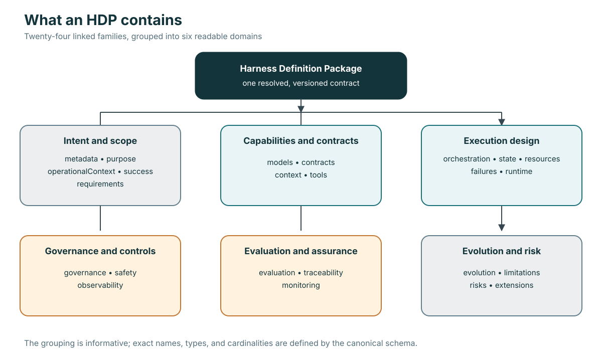
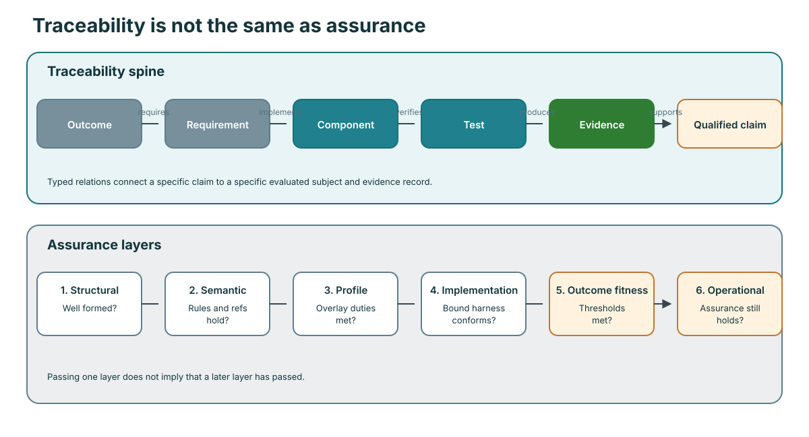

# Conceptual model

HDP separates concepts that are often collapsed into one configuration file.

## The outcome-bearing system

The model performs inference. The harness controls how inference participates
in work. The runtime enforces executable behavior. The environment supplies
systems, data, people, and operating conditions. A task is one sample from the
intended task distribution. The evaluator applies measures to a named subject.

## Four kinds of statement

An HDP distinguishes:

- **intent** — desired outcomes, non-goals, requirements, and acceptance;
- **mechanism** — capabilities, context, tools, orchestration, state, runtime;
- **constraint** — permissions, budgets, safety, privacy, failure handling;
- **evidence** — observations linked to subjects and claims.

Implementation mechanics do not establish intent. A repository containing a
test runner does not prove the business outcome that runner is meant to serve.

## Package anatomy

The 24 top-level information families form six related domains. This grouping
is informative; exact names, field types, and cardinalities come from the
canonical schema.

## Traceability

The core trace connects outcomes to requirements, implementation, tests,
evidence, and qualified claims. Conformance and assurance remain distinct
layers.

Each arrow has a typed meaning. A component can implement a requirement; a test
can verify a component or requirement; evidence can be produced by a test.
Those relations are not interchangeable.

## Public and private evaluation material

The HDP exposes the acceptance contract needed for planning and traceability.
Evaluator-owned hidden cases, answers, prompts, and labels stay outside the
harness. Public definitions may carry opaque IDs, commitments, measures, and
custody metadata without carrying secret material.

## Definition, binding, implementation, and evidence

- The **HDP** states implementation-neutral semantics.
- A **binding** maps abstract capabilities to concrete systems.
- An **implementation** realizes the bound harness.
- A **conformance report** says which definition rules were checked.
- **Outcome evidence** says what happened for the evaluated subject.

These artifacts have separate identities and versions.
