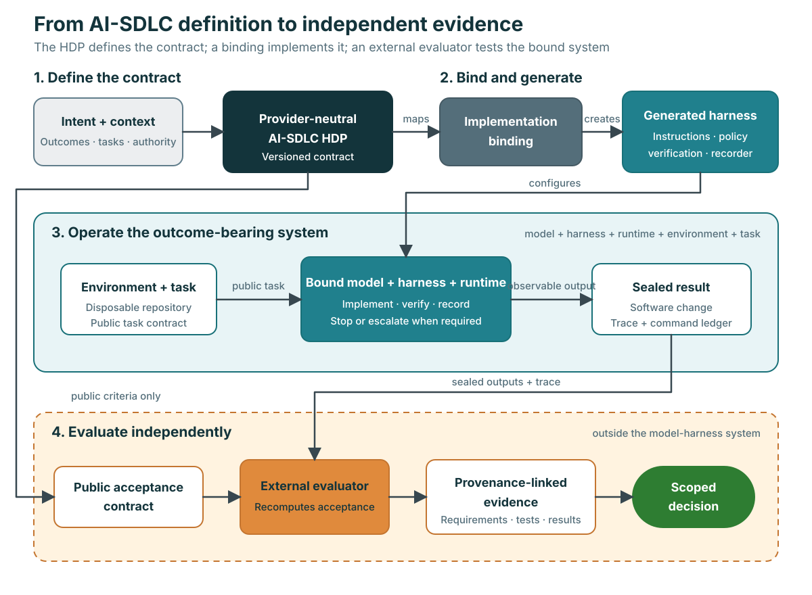

# Worked example: an AI-SDLC harness

This example shows how a Harness Definition Package can describe a practical
software-development harness without tying the definition to a model provider,
agent host, orchestration framework, or tool protocol.

The example harness is intended to let a coding agent implement, repair, or
refactor a small Python system while preserving least privilege, required
verification, auditable evidence, and an evaluator that remains outside the
model-harness system. The complete machine-readable definition is
[`hdp.yaml`](hdp.yaml).

> **Example status:** `hdp.yaml` is a structurally and semantically validated
> HDP Draft 0.1 example. This repository does not ship a runtime binding,
> generated harness, private acceptance corpus, or execution result for it.
> The example demonstrates the contract and implementation path; it is not a
> production-readiness or outcome-assurance claim.

## The system at a glance

  

*The diagram is informative. [`hdp.yaml`](hdp.yaml), the
[HDP schema](../../schema/hdp.schema.json), and the
[semantic rules](../../schema/semantic-rules.yaml) are the authoritative
sources.*

The diagram separates two responsibilities that are often mixed together:

- The **outcome-bearing system** contains the model, generated harness,
  runtime, environment, and task. It performs the software work and records
  what happened.
- The **independent evaluator** is outside that system. It evaluates sealed
  outputs and evidence against the public acceptance contract. Hidden cases,
  answers, and evaluator-only material are never generation inputs.

## Intended outcome and operating scope

The HDP defines two outcomes:

1. A requested software change passes an independent external acceptance
   oracle.
2. Required verification and prohibited-action controls are supported by
   auditable evidence.

The reference workload is deliberately bounded. It covers a disposable Python
3.12 repository, one small dependency-free task per run, and explicit
permission-denial probes. It excludes production repositories, secrets,
deployment, publication, live systems, and remote mutations.

Four scenario classes exercise different parts of the contract:

| Scenario | What it tests |
| --- | --- |
| Feature | Implement new behaviour and satisfy external functional acceptance. |
| Defect fix | Repair incorrect behaviour without expanding scope or authority. |
| Refactor | Preserve behaviour while changing the implementation. |
| Policy block | Deny a prohibited external publication action and preserve denial evidence. |

These scenarios describe the expected task distribution. They do not encode a
solution to any fixture task.

## How the HDP becomes an operating harness

An HDP is a definition, not a runtime. A usable implementation completes the
following path:

1. **Validate the definition.** Check the HDP against the canonical JSON Schema
   and semantic rules. Unresolved references, missing controls, or
   contradictions stop the process.
2. **Create an implementation binding.** Map required capabilities to a
   concrete model, tools, runtime, sandbox, repository environment, and
   evaluator. The binding can narrow authority but must not silently widen it.
3. **Generate or configure the harness.** Produce the instructions,
   orchestration stages, tool controls, state files, verification loop, and
   evidence recorder required by the HDP. Record which source fields produced
   each generated artifact.
4. **Operate the bound system.** Give the agent only the public task contract
   and allowed workspace. The system performs the change, runs required public
   checks, records interventions, and stops on declared conditions.
5. **Freeze the candidate result.** Seal the change, trace, command ledger,
   runtime identity, and relevant digests before evaluation.
6. **Evaluate independently.** Run the external evaluator without allowing the
   generated harness or candidate workspace to modify it. Recompute important
   evidence rather than trusting agent-authored summaries.
7. **Issue a scoped decision.** Report conformance, outcome fitness, failures,
   uncertainty, and residual risk only for the evaluated definition, binding,
   environment, task distribution, and versions.

The implementation remains provider-neutral at the HDP layer. A binding might
use Agent Skills, Agent Spec, MCP, A2A, OpenAPI, local commands, container
controls, or provider-specific configuration where those choices satisfy the
declared contracts. None of those technologies is required by this example.

## What an implementation must map

The HDP gives an implementer enough information to construct a binding without
inventing the intended outcome or authority model:

| HDP area | Implementation responsibility |
| --- | --- |
| `purpose`, `success`, `requirements` | Preserve the intended outcomes, hard thresholds, and MUST requirements. |
| `models`, `tools`, `contracts`, `context` | Select compatible capabilities and expose only declared inputs, outputs, knowledge, and tools. |
| `orchestration`, `state`, `failures` | Implement the orient, implement, verify, recovery, escalation, and checkpoint behaviour. |
| `governance`, `resources`, `safety` | Enforce default-deny permissions, workspace boundaries, network denial, budgets, timeouts, and approvals. |
| `evaluation`, `observability` | Keep the evaluator external, record trace events, protect hidden material, and bind results to the run. |
| `traceability`, `monitoring`, `evolution` | Preserve stable identifiers, detect relevant drift, and trigger reassessment after material changes. |

If a target environment cannot enforce a hard requirement—such as the declared
filesystem or network boundary—the binding should report the unsupported
control and stop. Prompt instructions or a command wrapper alone are not proof
of OS-level isolation.

## Follow one requirement to evidence

The traceability graph makes each success claim inspectable. For example, the
functional path is:

| Relationship | Stable identifiers |
| --- | --- |
| Intended outcome | `OUTCOME-CORRECT-CHANGE` |
| Decomposed requirement | `REQ-FUNCTIONAL-RENDER` |
| Implementing component | `ARTIFACT-HARNESS` |
| Independent test | `TEST-EXTERNAL-FUNCTIONAL` |
| Resulting evidence | `ARTIFACT-EVALUATION` |

The controlled-process outcome similarly traces through verification,
permission, and evidence-ledger requirements to process and permission tests.
The external evaluation report and command ledger are separate evidence
artifacts because self-recorded process evidence is not the functional
acceptance oracle.

## Point your AI at the example

Give your AI access to this repository and your intended implementation
environment. Then ask:

> Read `examples/software-development/README.md` and treat
> `examples/software-development/hdp.yaml` as the authoritative harness
> contract. Assess whether my environment can implement it without widening
> authority. Return a mapping from every required capability and control to a
> concrete implementation mechanism, list unsupported or uncertain items, and
> propose the generated artifacts, external evaluation boundary, and evidence
> plan. Do not expose hidden evaluator material or claim the harness is usable
> until the bound system has passed independent evaluation.

Before letting the AI generate or execute anything, provide the missing
environment facts it asks for—especially the available model capabilities,
tool interfaces, sandbox enforcement, approval mechanism, evaluator custody,
and deployment target.

## Evidence expected from a real execution

A credible result for this example would preserve, at minimum:

- the exact HDP, implementation binding, generated-artifact manifest, and
  content digests;
- model, runtime, toolchain, operating-system, and dependency versions;
- the public task input, final diff, command ledger, trace events,
  interventions, and stopping-condition records;
- independent functional, process, permission, leakage, negative, and
  regression results;
- proof that the evaluator and hidden material were outside the writable
  candidate workspace;
- failures, repairs, unresolved assumptions, residual risks, and the exact
  scope of any pass claim.

Generated tests and agent-authored completion summaries are useful evidence,
but they are not independent acceptance.

## Known limits

- The task distribution is a small Python corpus, not the full range of
  software-development work.
- The HDP describes required isolation but cannot make a weak host sandbox
  strong; runtime enforcement must be demonstrated separately.
- Model behaviour is non-deterministic. Repeated clean executions are needed
  before estimating reliability.
- Passing one fixture does not establish production fitness, security,
  standards certification, or superiority over another harness.
- Any change to the definition, binding, generator, model, runtime, evaluator,
  fixture, or environment can invalidate earlier evidence and require
  reassessment.

For a smaller starting point, see the [minimal example](../minimal/hdp.yaml).
For a non-software domain, see the
[document-review example](../document-review/hdp.yaml).
